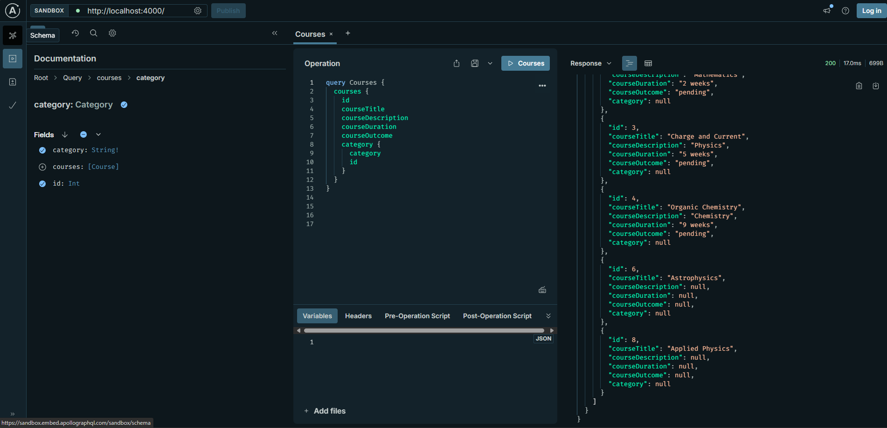
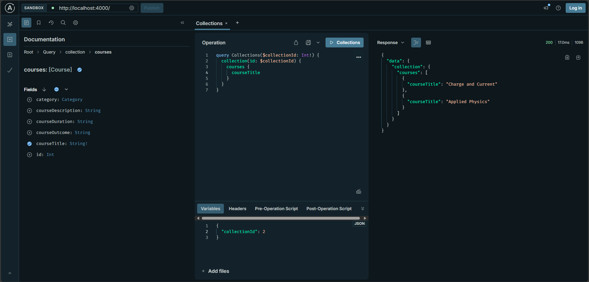

## Setup

after running npm i and configuiring the database string in a `.env` file, run `npx prisma generate` and `npx prisma migrate dev`. to set up the database.
after this, run `npx prisma db seed` to seed the database and finally `npm run start` to start the server.

# Demo

### Queries

### Mutations

To verify the authorization works, generate a token by logging in, copy and paste the token into headers under authorization, and run the mutations

## Finishing

To complete bonus, you can set up additional fields on each user for their role and when the token obtained for each request via the context, you can query the database for the user role. Alternatively, you can just store the role on the jwt token or in context to reduce database calls and only query the current user in context.
